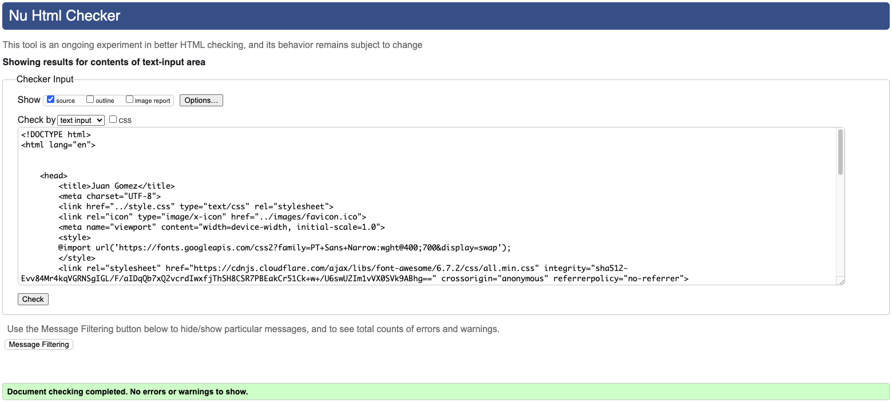

# My Portfolio


## `Description`

My online portfolio and my very first project.

This was created with HTML and CSS using VSCode. I hope to add and improve upon this in the future.

## `Getting Started`

From the navigation bar on the top right of the page, you can navigate through the various pages on of the portfolio.

### Dependencies

* No particular prerequisites required to open My Portfolio.
* Open with MacOS, Windows, IOS and Android.

## `Testing` 

Every page was run through the official W3C validator and results are as follows:

* Home page

Meta and link tags were placed outside of the head tag causing this error to pop up.
Trailing forward slash and empty name attribute.


Meta and link tags moved inside the head tag.
Forward slash removed as well. as empty name attribute.
No errors after that.


* About page 

Section tag was placed outside the body tag.
Only one p tag present instead of two, with the ul tag in between.


All issues corrected and no errors.


* Projects page

No issues with the contact page.


* Contact page

No issues with the contact page.


### *CSS validation*
The CSS page was run through the W3C CSS validator and returned no errors.


## `Accessibility`
After running a lighthouse report, I identified some issues that needed to be fixed.

Original report 


example issue was that code was missing the following 

https://www.w3schools.com/css/css_rwd_viewport.asp

after adding the below code to my html files:

```
<meta name="viewport" content="width=device-width, initial-scale=1.0">
```
I then ran another report and the performance increased


## `Acknowledgments`

Inspiration and thank you to the following:

[Template](https://gist.github.com/DomPizzie/7a5ff55ffa9081f2de27c315f5018afc) for this Readme.

[Colours](https://htmlcolorcodes.com/) for the portfolio chosen.

[Basics](https://www.learningpeople.com/uk/) for creating this portfolio.